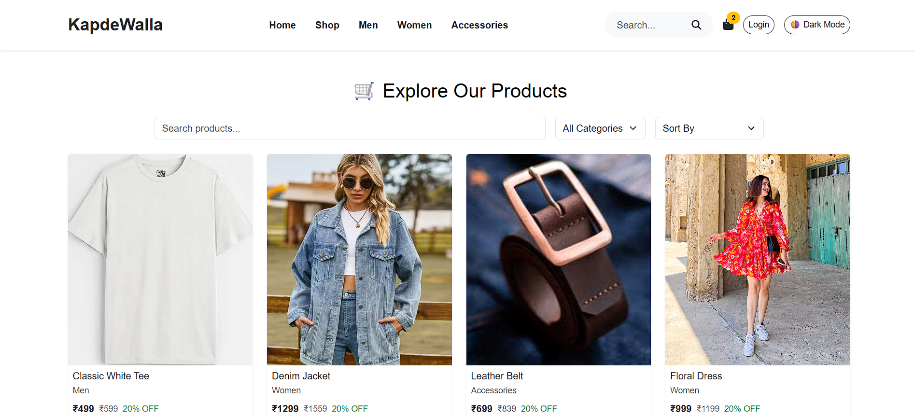
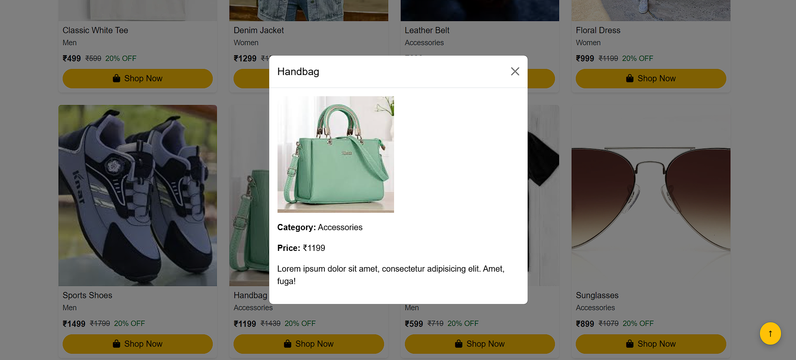
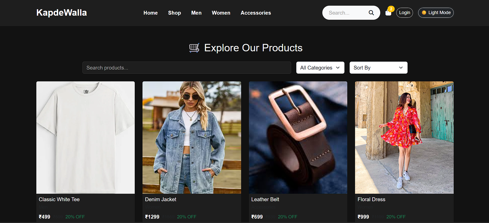
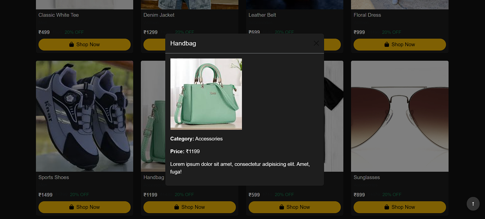

# 🛍️ KapdeWalla – Product Listing Page

An interactive and responsive static fashion product listing page built using HTML, CSS, Bootstrap 5, and vanilla JavaScript. This page is part of the KapdeWalla e-commerce project and features dynamic product filtering, sorting, dark mode, and modal previews.

---

## ✨ Features

- ✅ Semantic HTML5 structure
- ✅ Responsive grid layout using Bootstrap 5
- ✅ Dynamic product filtering by category and search
- ✅ Price sorting: Low to High / High to Low
- ✅ Product preview modal on card click
- ✅ Add to Cart and Buy Now buttons
- ✅ Light/Dark theme toggle
- ✅ Smooth "Back to Top" button
- ✅ Mobile-first design

---

## 📸 Screenshots

> Product Listing Page Preview  

> Product Listing Page Preview dark mode 

---

## 🚀 Live Demo

🔗 [Visit Product Page on GitHub Pages](https://Pranay3034.github.io/kapdewalla-product-page/)

---

## 🛠️ Built With

- 💻 HTML5 (semantic structure)
- 🎨 CSS3 (custom styling + animations + dark mode)
- 🧱 Bootstrap 5 (responsive layout & components)
- ⚙️ JavaScript (for filtering, sorting, modal, and theme toggle)
- 🖼️ Font Awesome (icons for UI interactions)

---

## 🙌 Acknowledgements

Made with ❤️ as part of a frontend internship task.  
Special thanks to [Bootstrap](https://getbootstrap.com), [Font Awesome](https://fontawesome.com), and the [Open Source Community](https://github.com/) for resources and inspiration.

---

## 📬 Contact

If you'd like to connect:

- 🔗 [LinkedIn – Pranay Gedam](https://www.linkedin.com/in/pranay-gedam-b86a0a339/)
- 🐙 [GitHub – @Pranay3034](https://github.com/Pranay3034)

---

> ⚡ Feel free to fork this repo, give it a ⭐ star, or suggest improvements!

